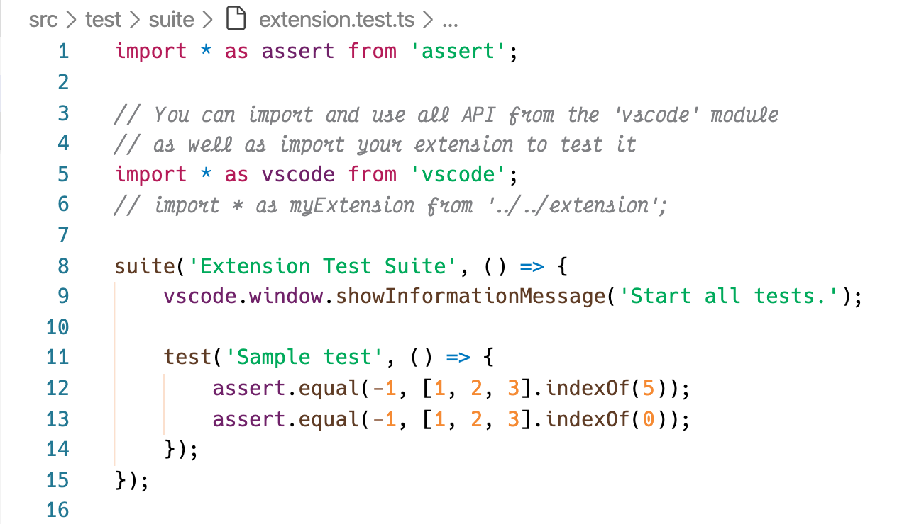
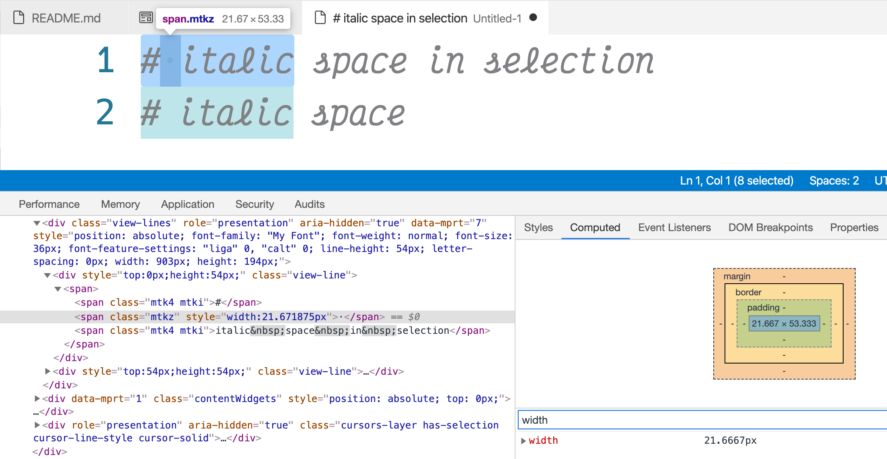
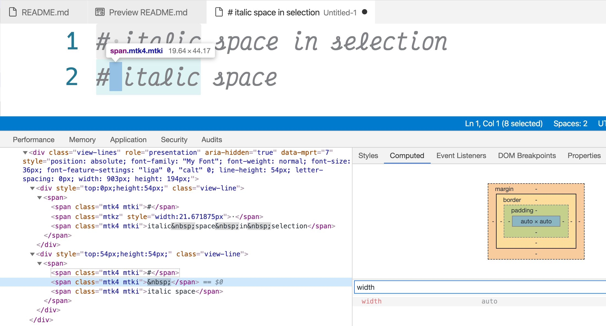
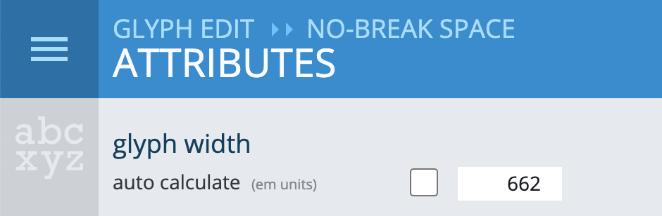

# Hactor

This is [Hactor](https://github.com/dqisme/Hactor), A font alternative to [Operator Mono](https://www.typography.com/fonts/operator/overview) by combination of [Hack](https://github.com/source-foundry/Hack) and [Victor Mono](https://github.com/rubjo/victor-mono).

This font family consists of four parts:

- Regular - from Hack Regular
- *Italic* - from Victor Mono Medium Italic
- **Bold** - from Hack Bold
- ***Bold Italic*** - from Victor Mono Bold Italic

## How to use

You just download the four font `*.ttf` files and double-click each of them to install.

## How to contribute

Let me explain how did I get this, so the basic idea is to combine the Hack for regular and the Victor Mono for italic. And then change all of them into a new font name. Because Operating System just recognise font only by name and some type properties. So there is no need to make them all into one file.

The step to change their names:

- Use [Glyphr Studio Online](https://www.glyphrstudio.com/online/) to change its name and export into `*.otf`
  - Load the source font file by uploading
  - Change the name both in `font settings` in the left menu by clicking the hamburger.
  - Export the `*.otf` by the `export font` in the left menu then the `Export OTF Font`.
- Use [Convertio - Font Converter](https://convertio.co/font-converter/) to convert `*.otf` to `*.ttf`

### Selection shaking problem when used in Visual Studio Code(or any others but I am not sure)

If you use the font produced by the above steps, you might got the *selection shaking problem* like this:

The whole line will be expanded when selecting space characters in the Visual Studio Code editor.

The reason behind is, after debugging with Visual Studio Code developer tool, that the editor will render each space into a separated `` with a fixed number of width when the selection contains spaces.

The width of the space expands from `19.64px` to `21.67px` in the example above. And the strange width `21.67px` which I guess that calculated by the regular characters from `Hack`. But no need to worry about the reason, we can make the editor render the non-selected italic space wider by increasing the width of the corresponding glyph in font.

So the key to solve this problem is to give a width to the space/no-break space glyph in the Victor Mono Italic.

But what's the exact width it should be? First, I checked the space will be okay in the case of the normal Victor Mono. And the fixed width of all the monospaced character in Victor Mono is `600`. That means `19.64px` is okay for `600`.

Now I suppose the character width rendered by Visual Studio Code has a linear relationship with the glyph width. That means, the exact width should `600 / 19.64px * 21.67px` which is rounds to `622`.

Finally, the actions need to take is just finding the space (last glyph in the range of Basic Latin) and the no-break space(first glyph in the range of Latin Supplement) and set their width.

